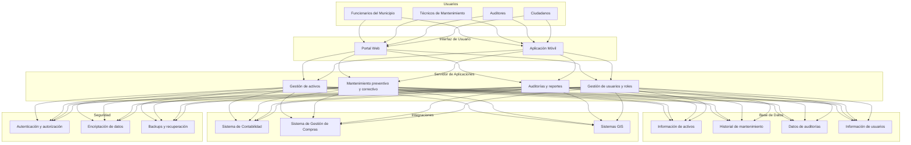

```mermaid
graph TB
    %% Usuarios
    subgraph Usuarios
        A[Funcionarios del Municipio]
        B[Técnicos de Mantenimiento]
        C[Auditores]
        D[Ciudadanos]
    end

    %% Interfaz de Usuario
    subgraph Interfaz de Usuario
        E[Portal Web]
        F[Aplicación Móvil]
    end

    %% Servidor de Aplicaciones
    subgraph Servidor de Aplicaciones
        G[Gestión de activos]
        H[Mantenimiento preventivo y correctivo]
        I[Auditorías y reportes]
        J[Gestión de usuarios y roles]
    end

    %% Base de Datos
    subgraph Base de Datos
        K[Información de activos]
        L[Historial de mantenimiento]
        M[Datos de auditorías]
        N[Información de usuarios]
    end

    %% Integraciones
    subgraph Integraciones
        O[Sistema de Contabilidad]
        P[Sistema de Gestión de Compras]
        Q[Sistemas GIS]
    end

    %% Seguridad
    subgraph Seguridad
        R[Autenticación y autorización]
        S[Encriptación de datos]
        T[Backups y recuperación]
    end

    %% Relaciones
    A --> E
    B --> E
    C --> E
    D --> E

    A --> F
    B --> F
    C --> F
    D --> F

    E --> G
    E --> H
    E --> I
    E --> J

    F --> G
    F --> H
    F --> I
    F --> J

    G --> K
    G --> L
    G --> M
    G --> N

    H --> K
    H --> L
    H --> M
    H --> N

    I --> K
    I --> L
    I --> M
    I --> N

    J --> K
    J --> L
    J --> M
    J --> N

    G --> O
    G --> P
    G --> Q

    H --> O
    H --> P
    H --> Q

    I --> O
    I --> P
    I --> Q

    J --> O
    J --> P
    J --> Q

    G --> R
    G --> S
    G --> T

    H --> R
    H --> S
    H --> T

    I --> R
    I --> S
    I --> T

    J --> R
    J --> S
    J --> T

```
